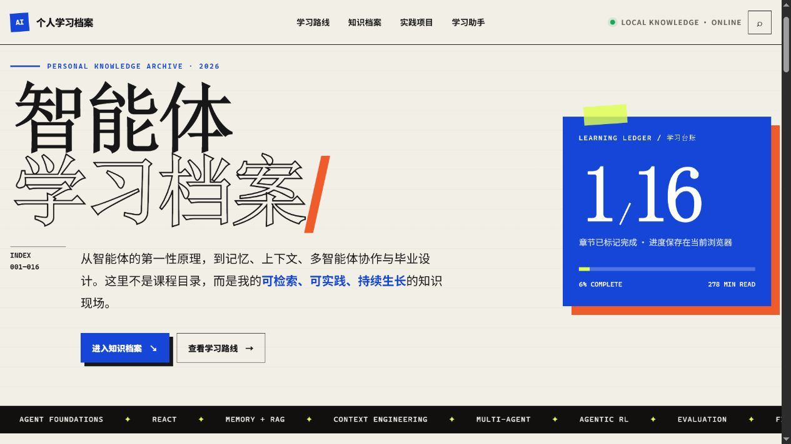
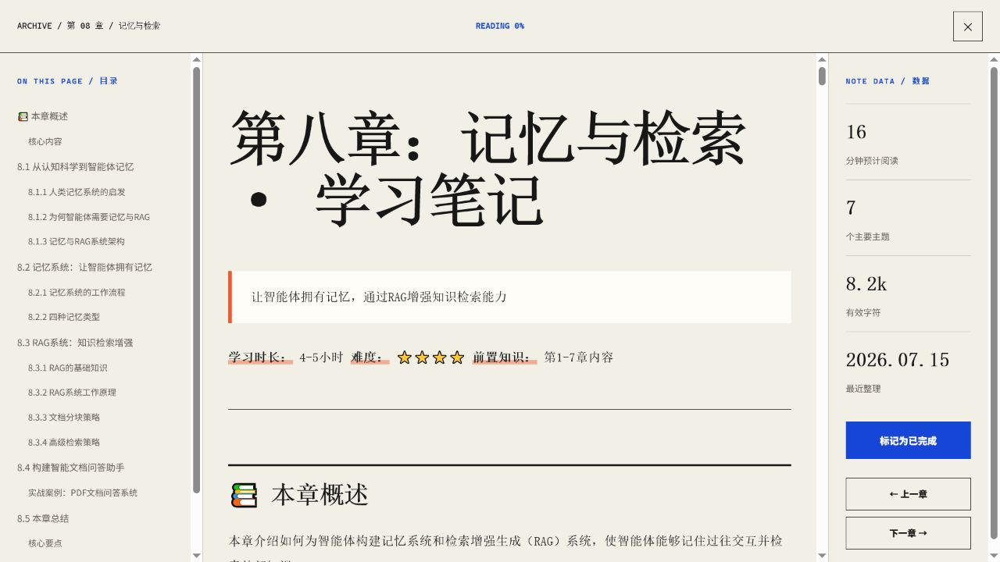
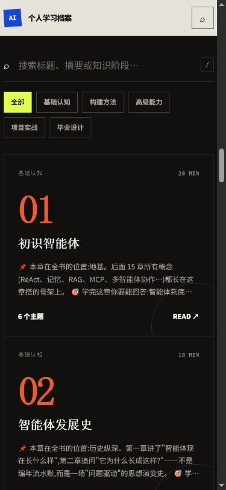

# Hello Agents Pro

一个本地优先的智能体个人学习网站：把 16 章 Markdown 笔记整理成可搜索、可阅读、可实践、可持续积累的个人知识档案。



## 界面预览

### 沉浸式章节阅读

自动生成章内目录、阅读数据与上下章导航，让长篇 Markdown 笔记更适合持续学习。



<details>
<summary><strong>查看移动端知识档案</strong></summary>

<br>

在手机上也可以搜索、筛选和阅读全部章节。



</details>

## 功能

- 16 章智能体学习笔记与 129 个主题
- 五阶段学习路线、搜索和阶段筛选
- Markdown 长文阅读器、目录、上下章和代码复制
- 浏览器本地学习进度
- 本地计算、ReAct、Plan-and-Solve、Reflection 和课程知识问答
- 不需要 API Key，不调用外部 AI 服务

## Windows 一键启动

环境要求：Windows 10/11、Python 3.9 或更高版本。

```powershell
git clone https://github.com/jizhaoyu/hello-agents-pro.git
cd hello-agents-pro
./启动学习网站.bat
```

首次启动会在 `web_demo/.venv` 创建独立虚拟环境并安装 Flask。健康检查通过后，浏览器会自动打开 [http://127.0.0.1:5000](http://127.0.0.1:5000)。关闭启动窗口即可停止服务。

## 手动启动

```powershell
cd web_demo
python -m venv .venv
./.venv/Scripts/python.exe -m pip install -r requirements.txt
./.venv/Scripts/python.exe app.py
```

然后访问 [http://127.0.0.1:5000](http://127.0.0.1:5000)。

## 测试

```powershell
./web_demo/.venv/Scripts/python.exe -m unittest -v web_demo/test_share_site.py
```

## 项目结构

```text
├── notes/                  # 16 章 Markdown 学习笔记
├── assets/screenshots/     # README 界面预览图
├── code/super_agent.py     # 纯本地学习助手
├── web_demo/
│   ├── frontend/index.html # 单页前端
│   ├── app.py              # Flask 服务
│   ├── requirements.txt
│   └── test_share_site.py
├── 启动学习网站.bat
└── 先看这里.txt
```

## 安全与隐私

- 服务只监听 `127.0.0.1`，默认不开放局域网访问。
- 不包含 API 密钥，也不会产生 AI API 费用。
- 章节完成状态仅保存在当前浏览器。
- 学习助手的会话记忆仅存在于当前服务进程，关闭后自动清除。

## 更新笔记

直接编辑 `notes` 中的 Markdown 文件并刷新网页。网站会根据文件修改时间自动刷新目录缓存。

## License

[MIT](LICENSE)
